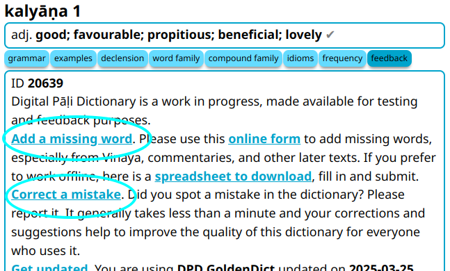

# Помощь с Пали

Самый простой способ помочь с Пали:

1. Нажмите на эту ссылку, чтобы добавить любые [__отсутствующие слова__](https://docs.google.com/forms/d/e/1FAIpQLSfResxEUiRCyFITWPkzoQ2HhHEvUS5fyg68Rl28hFH6vhHlaA/viewform?usp=pp_url&entry.1433863141=dpd-db){target="_blank"}, которые вы встретите.
2. Нажмите на эту ссылку, чтобы исправить любые [__ошибки__](https://docs.google.com/forms/d/e/1FAIpQLSf9boBe7k5tCwq7LdWgBHHGIPVc4ROO5yjVDo1X5LDAxkmGWQ/viewform?usp=pp_url&entry.1433863141=dpd-db){target="_blank"}, которые вы заметите.
3. Нажмите на эту ссылку, чтобы добавить [__недостающие детали__](https://docs.google.com/forms/d/e/1FAIpQLSf9boBe7k5tCwq7LdWgBHHGIPVc4ROO5yjVDo1X5LDAxkmGWQ/viewform?usp=pp_url&entry.1433863141=dpd-db){target="_blank"} к словарным статьям.

Для этого проекта используются Google Forms. Самый быстрый способ получить доступ к формам — открыть кнопку __о словаре__.

Если вы хотите заняться чем-то более значительным, пожалуйста, [свяжитесь с нами по электронной почте](mailto:devamitta@sasanarakkha.org), и мы обсудим возможные варианты взаимодействия.
