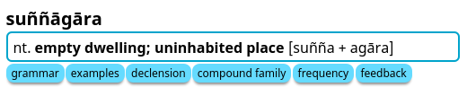
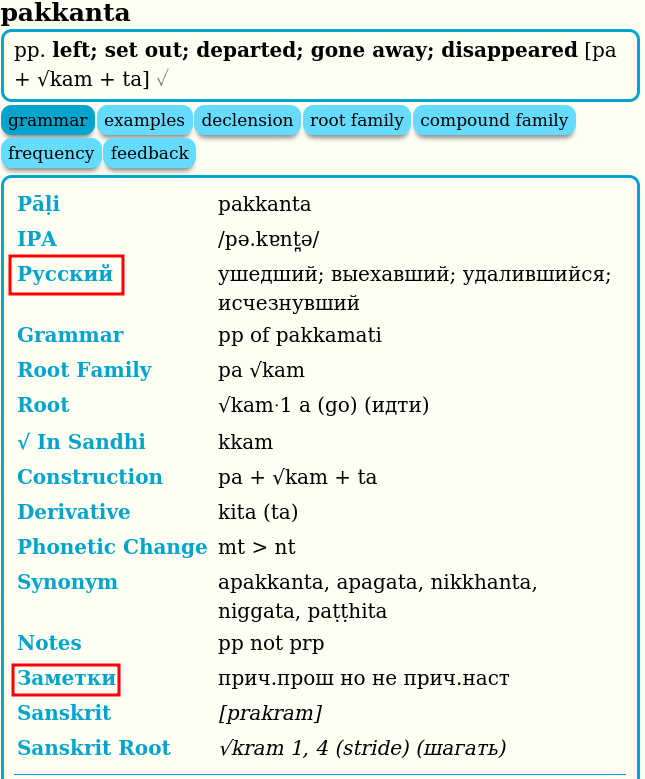
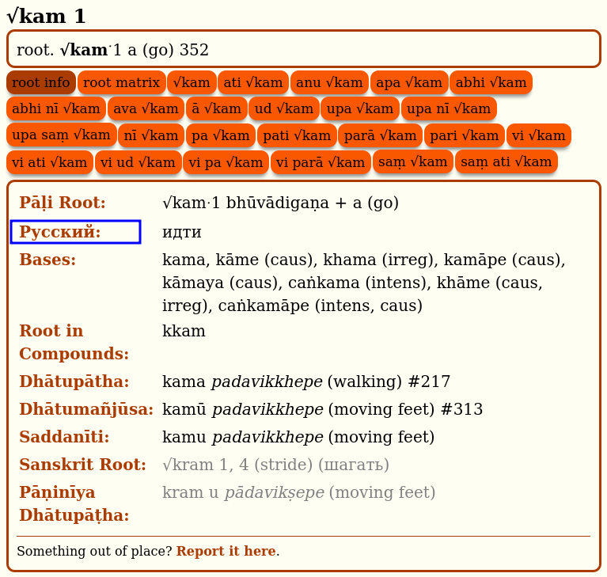
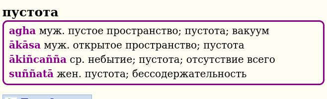
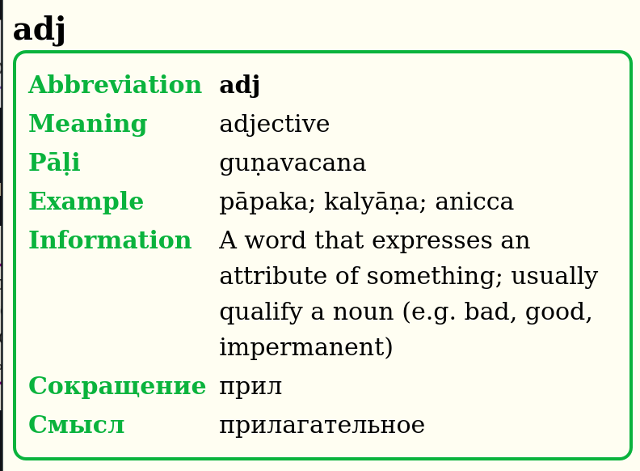
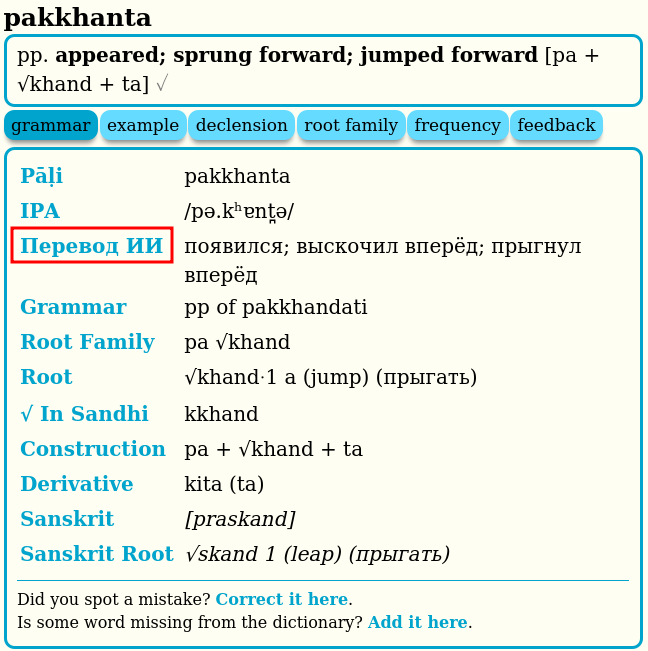

# Совмещенная версия DPD Английский + Русский

[GoldenDict версия](https://github.com/sasanarakkha/dpd-db-sbs/releases/latest//latest/download/dpd+rus-goldendict.zip)

[MDict версия](https://github.com/sasanarakkha/dpd-db-sbs/releases/latest//latest/download/dpd+rus-mdict.zip)

## DPD+RUS содержит пять различных словарей

### Словарь Палийского языка на анлийский (синий)

В разделе "grammar" добавлен русский перевод. Щелкните на "Русский", "Перевод ИИ" или "Заметки", чтобы перейти на страницу отзывов, где можно сообщить об ошибке или внести предложение в русскую часть DPD.

### Словарь корней Палийского языка (оранжевый)

В разделе "root info" добавлен русский перевод смысла корней на Пали и Санскрите. Щелкните на "Русский", чтобы перейти на страницу отзывов, где можно сообщить об ошибке или внести предложение в русскую часть DPD.

### Словарь английского на Палийский язык (фиолетовый)

### Словарь русского на Палийский язык (фиолетовый)

### Словарь сокращений и помощи (зеленый)

## Перевод нейронными сетями

Важно отметить, что часть информации в словаре была частично переведена с использованием технологий искусственного интеллекта, нейронными сетями [GPT 4o](https://platform.openai.com/overview). Этот процесс позволяет нам расширять словарь и обновлять его с более высокой скоростью. Однако, такие переводы требуют дополнительной проверки для обеспечения точности и достоверности информации. Поэтому, записи, полученные с помощью искусственного интеллекта, помечены как **[пер. ИИ]**. Если вы обнаружите явно некорректный перевод ИИ, пожалуйста, сообщите нам через [Google форму.](https://docs.google.com/forms/d/1iMD9sCSWFfJAFCFYuG9HRIyrr9KFRy0nAOVApM998wM/viewform?). 

Такие незавершенные переводы отмечены серым символом для обозначения степени завершенности данных (✓◑✗). Подробнее о значениях этих символов можно [узнать в описании особенностей словаря.](features/features.md)

---

Подробное описание английской части словаря читайте на [оригинальной старанице сайта](https://digitalpalidictionary.github.io/).