# Особенности

## DPD содержит четыре различных словаря

### Словарь Палийского языка на русский

### Словарь корней Палийского языка

Для получения дополнительной информации [нажмите здесь](rootdict.md)

### Словарь русского на Палийский язык

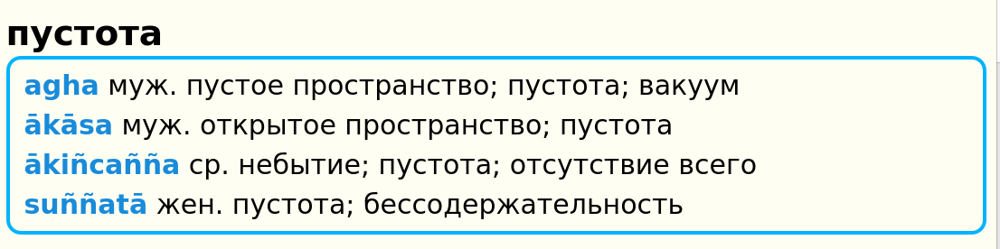

### Словарь сокращений и помощи

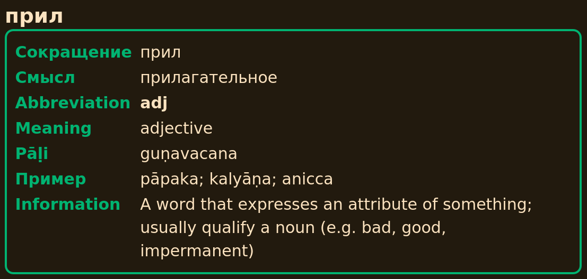
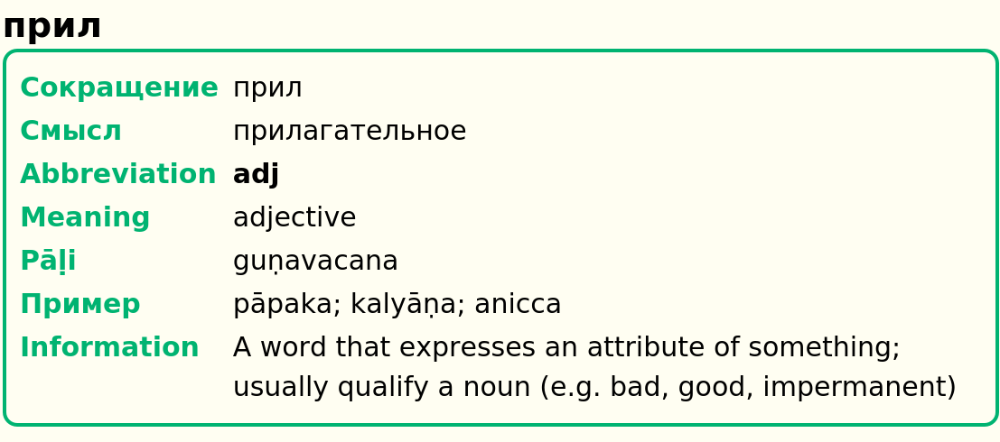

## Два дополнительных словаря

Существует два дополнительных словарных набора, которые работают в связке с DPD. Первый посвящен [разбору составных слов и разложению сложных слов](sandhi.md), а второй - [грамматический словарь](grammardict.md), который может объяснить падеж каждого измененного слова в тексте. Щелкните по ссылкам, чтобы узнать больше.

## DPD распознает 1,5 миллиона уникальных измененных форм слов Палийского языка

Когда вы выбираете слово в тексте на Палийском языке и нажимаете сочетание клавиш, DPD автоматически определяет все главные слова, к которым принадлежит эта измененная форма. Например, клик по *takkarassa* автоматически откроет *takkara*.

## 100% Распознавание словаря в этих книгах

DPD распознает все слова, как в **Chaṭṭha Saṅgāyana Tipiṭaka**, так и в **Mahāsaṅgīti** издании на Sutta Central, включая все сложные слова и соединения, в следующих книгах:

**Виная**: Pārājikapāḷi , Pācittiyapāḷi 
**Сутты**: Все четыре Никаи 
**Кхуддака Никая**: Khuddakapāṭha, Dhammapada, Udāna, Itivuttaka, Suttanipāta, Theragāthā 
**Вплоть до**: Therigāthā

## Кликайте по всему

Одна из  значительных особенностей GoldenDict - это возможность щелкнуть по любому слову, чтобы открыть определение этого слова. Это создает бесконечное пространство для изучения языка.

## Компактное представление

Вся важная информация на Палийском языке представлена в **одной компактной строке**, доступной на первый взгляд, а более подробная информация доступна при нажатии кнопок.

Основная информация включает часть речи, падеж, значение, буквальное значение и упрощенную конструкцию.

## Система нумерации

Если слова с несколькими значениями происходят из разных источников, их нумерация будет отражать это.

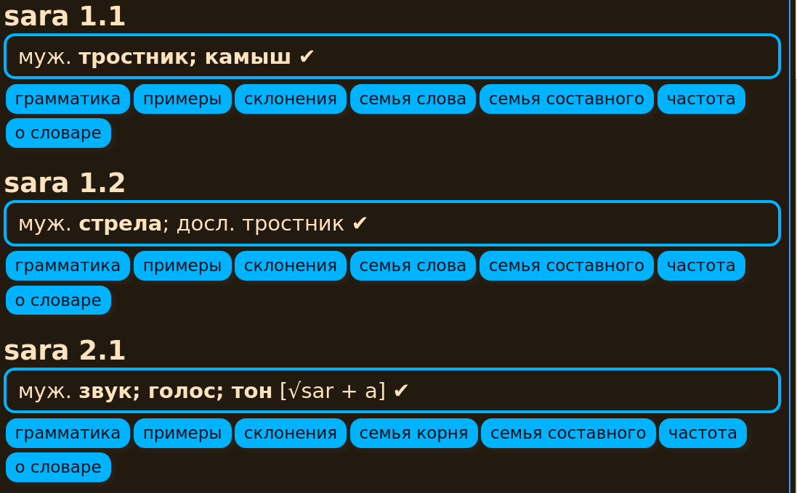
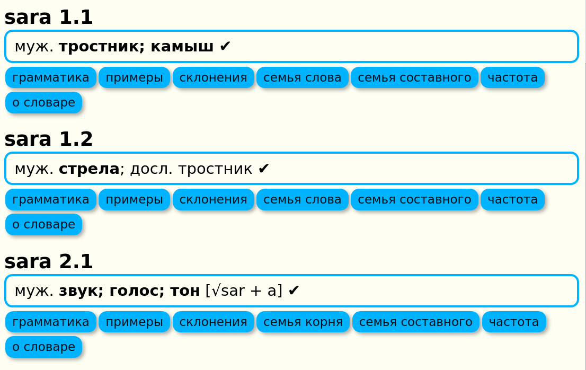

В приведенном выше примере 1.1 и 1.2 оба связаны с санскритским *śara*, в то время как 2.1 происходит от корня √sar (издавать звук), санскритское *svara*.

## Степень завершенности данных о словах

Поскольку DPD находится в процессе выполнения, полезно знать, насколько полны данные о слове. Это указывается символами (✓◑✗) после записи.

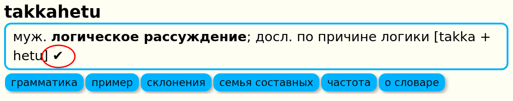

✔ галочка означает, что данные о слове в основном завершены с контекстуальным значением, грамматической информацией, примерами из сутт и другой соответствующей информацией.

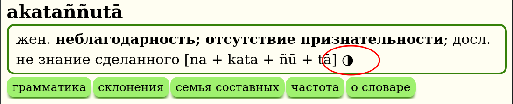

◑ половина круга означает, что данные о слове частично завершены с контекстуальным значением и грамматической конструкцией, но минимальной другой информацией.

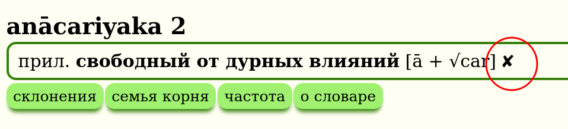

✗ крестик означает, что данные о слове все еще находятся в процессе создания и содержат только таблицу измененных форм, таблицу частотности и очень базовую информацию.

В русском словаре дополнительно эти символы могут быти либо серого цвета (✓◑✗) если перевод еще не был проверен, либо основого цвета (✓◑✗) если перевод уже проверен и утвержден.

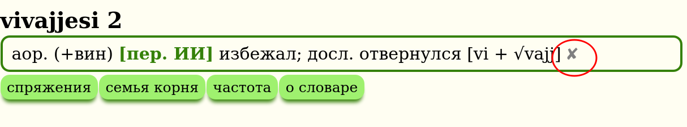

## Перевод нейронными сетями

Важно отметить, что часть информации в словаре была частично переведена с использованием технологий искусственного интеллекта, нейронными сетями [GPT 4o](https://platform.openai.com/overview). Этот процесс позволяет нам расширять словарь и обновлять его с более высокой скоростью. Однако, такие переводы требуют дополнительной проверки для обеспечения точности и достоверности информации. Поэтому, записи, полученные с помощью искусственного интеллекта, помечены как **[пер. ИИ]**. Если вы обнаружите явно некорректный перевод ИИ, пожалуйста, сообщите нам через [Google форму.](https://docs.google.com/forms/d/1iMD9sCSWFfJAFCFYuG9HRIyrr9KFRy0nAOVApM998wM/viewform?)

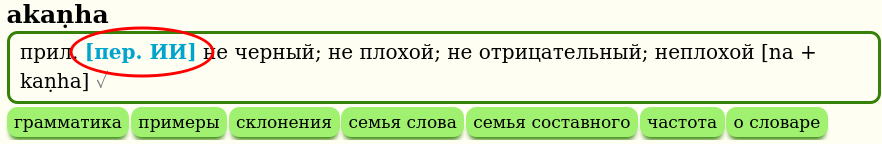

## Грамматика

Щелкните кнопку **грамматика**, чтобы получить более подробную грамматическую информацию о слове.

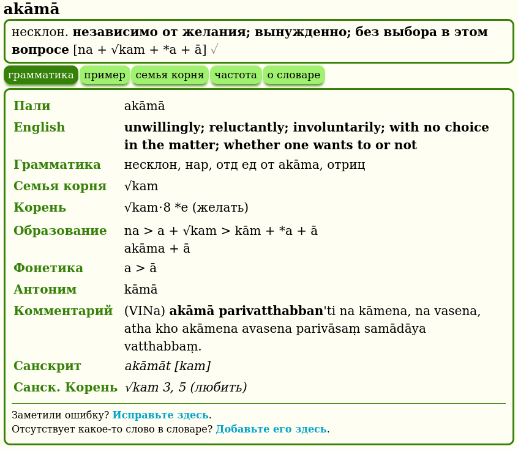

Это включает информацию о корне, детальное образование, производное, фонетические изменения, составное слово, антонимы, синонимы, комментарий, неиндоарийские родственные слова, санскритские родственные слова и санскритский корень.

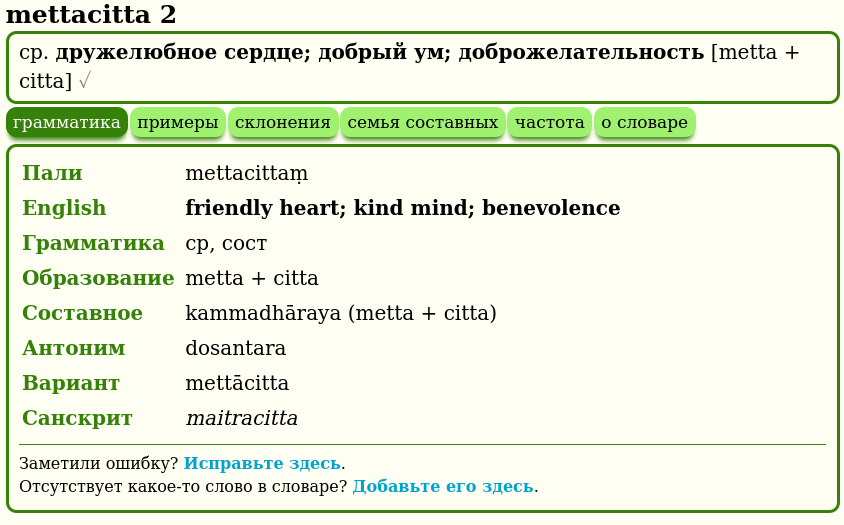

Если вы заметили ошибку, пожалуйста, нажмите ссылку, чтобы исправить ее.

# Примеры

Щелкните кнопку **примеры**, чтобы увидеть соответствующие примеры из сутт, содержащие слово.

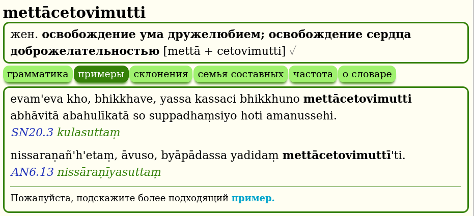

Если у вас есть лучший пример, пожалуйста, сообщите нам!

## Склонение / Спряжение

Щелкните кнопку **склонение** или **спряжение**, чтобы увидеть все измененные формы слова.

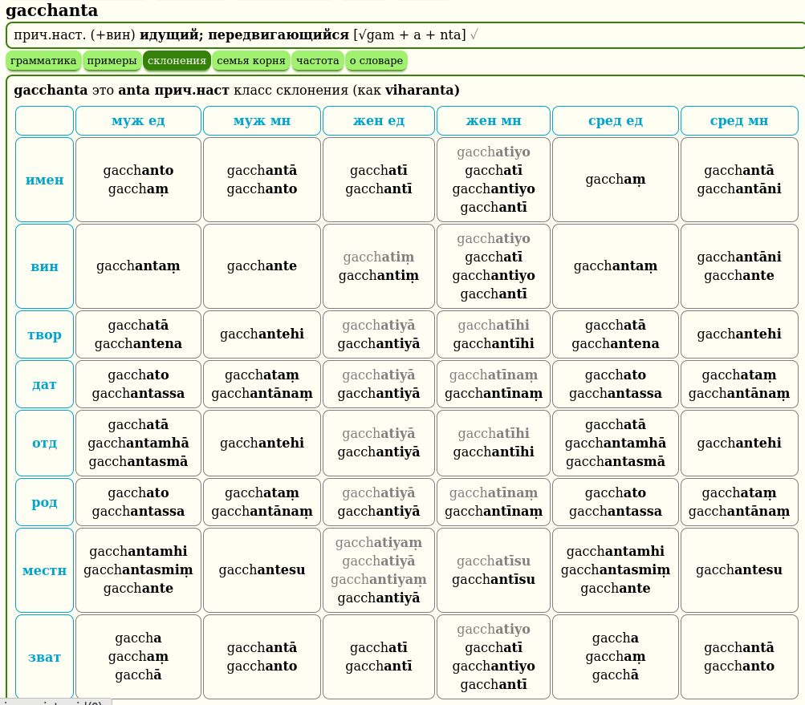

Эта таблица автоматически генерируется с использованием системы основа + шаблон, например, anicc + o. Неправильные склонения имеют свои собственные уникальные таблицы.

Измененные формы, не найденные в тексте Chaṭṭha Saṅgāyana, отмечены серым.

## Семья корня

Щелкните кнопку **семья корня**, чтобы увидеть все слова, которые имеют тот же префикс + корень.

Эта информация уникальна для DPD и основана на детальном изучении системы корней Палийского и санскритского языков. Это отлично подходит для изучения тонких оттенков значений, которые может показывать комбинация корня + префикса.

## Семья слова

Щелкните кнопку **семья слова**, чтобы увидеть все связанные слова, которые не происходят от корня, а созданы из первичного слова с использованием префиксов и суффиксов.

## Семья составного

Щелкните кнопку **семья составного**, чтобы увидеть коллекцию всех составных слов, которые содержат определенное слово.

Если само заглавное слово является составным, будут перечислены все семьи слов компонентов.

## Частотность слова

Щелкните кнопку **частота**, чтобы увидеть карту интенсивности того, где и как часто слово встречается в тексте Chaṭṭha Saṅgāyana.

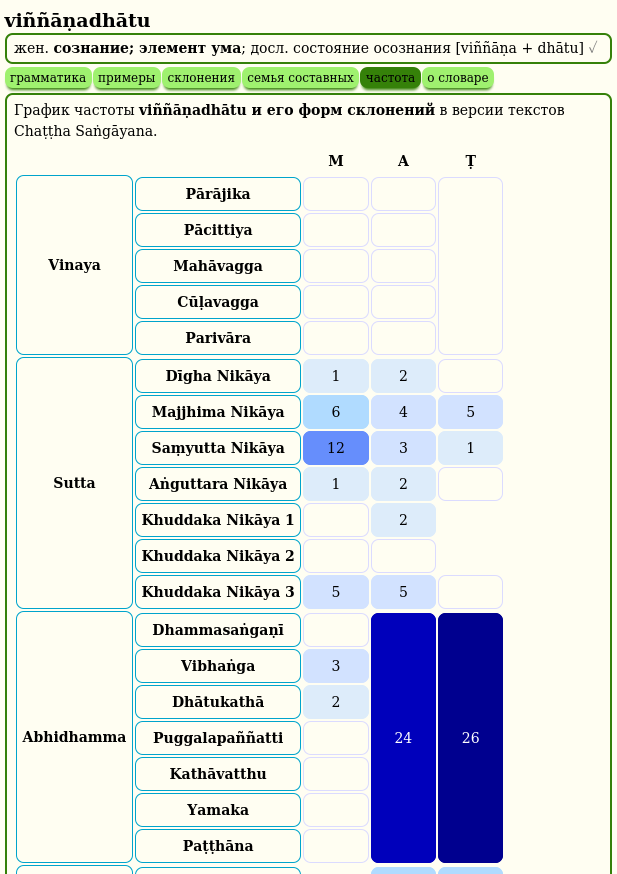

[Нажмите здесь](frequency.md) для получения более подробной информации об этой интересной функции.

## Английско-Палийский словарь

Щелкнув **любое русское слово** в GoldenDict, теперь можно получить доступ к русско-Палийскому словарю, который выводит список **точных** совпадений.

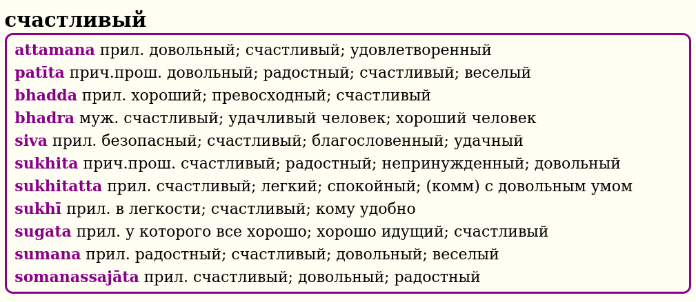

Или вы можете использовать **поиск по слову**, чтобы найти слово, фразу или идиому. В раскрывающемся списке будут отображаться все возможные варианты в процессе ввода слова для поиска.

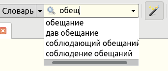

Или вы можете выделить любое слово, фразу или идиому и использовать **горячую клавишу**.

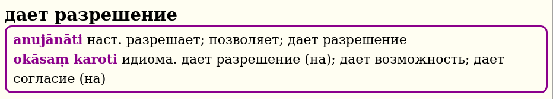

Эта функция предназначена для начинающих, которые испытывают трудности с переводом с русского на Палийский, и более продвинутых студентов, изучающих общение на Палийском языке.

## Обратная связь

Один из самых важных аспектов DPD - это обратная связь. Когда вы замечаете ошибку, пожалуйста, нажмите ссылку, чтобы исправить ее. Это открывает форму Google, которая автоматически заполняется заголовком.

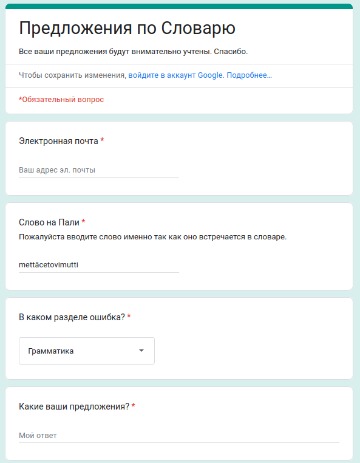

Это обычно занимает менее минуты, чтобы зарегистрировать ошибку, и помогает улучшить качество словаря для всех. Если у вас есть другие вопросы или комментарии, пожалуйста, сообщите нам!

## Ссылки на Википедию

Все цветы, деревья, растения и необычные животные содержат ссылку на статью Википедии для получения более подробной информации по теме. Индийские растения часто используются в ранних буддийских сравнениях, и одна картинка стоит тысячи слов.

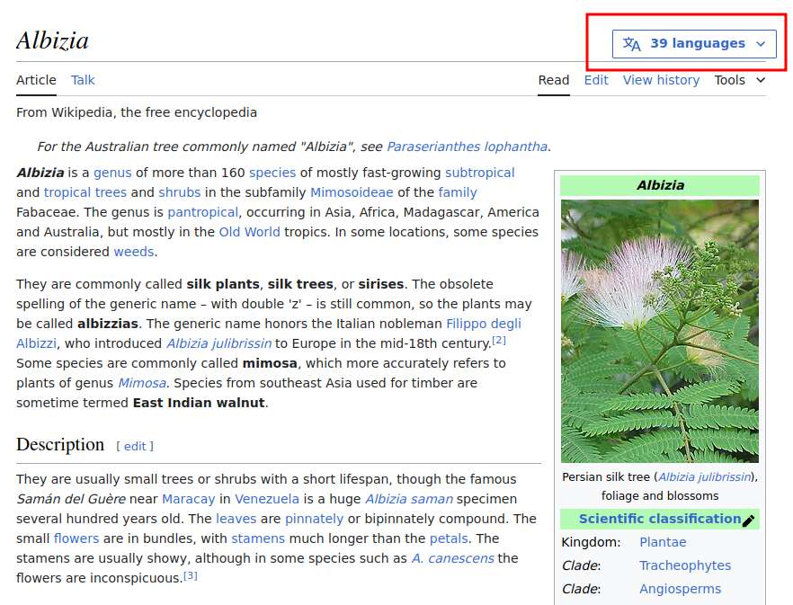

Можно быстро переключить язык статьи нажав на **language** и выбрав **Русский**.

## Шрифты

Если вы предпочитаете шрифт без засечек, установите [Noto Sans](https://fonts.google.com/noto/specimen/Noto+Sans), он хорошо работает с диакритическими знаками Пали. Если вы предпочитаете шрифт с засечками, установите [Deja Vu Serif](https://www.fontsquirrel.com/fonts/dejavu-serif) или [Verajja Serif](https://en.m.fontke.com/font/10186264/), специально созданный шрифт для текстов на Пали.

---

Достаточно теории, далее читайте как установить и настроить GoldenDict на вашем компьютере ([Windows](install_win.md) / [Mac](install_mac.md) / [Linux](install_linux.md) / [Android](install_android_dicttango.md)), или [обновить](update.md) его раз в месяц, если он уже установлен.