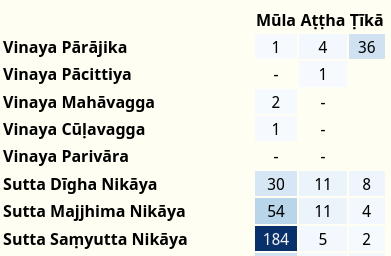
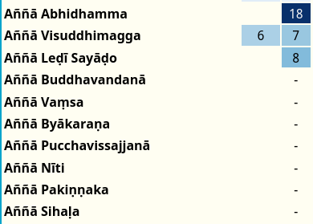

## Частота слов

Нажатие кнопки **частота** даст вам мгновенный обзор того, где и как часто слово может встречаться в тексте [Chaṭṭha Saṅgāyana](https://www.tipitaka.org/).

Эти карты частоты слов могут предоставить мгновенный доступ к картинке использования слов в различных слоях текстов и стать отправной точкой для дальнейшего изучения того, как слова на Пали и связанные с ними концепции развивались со временем.

### Соответствия

**Числа** представляют **точные совпадения** между **заголовком и всеми его склонениями** в разделе текста.

Для **заголовков в определенном падеже** (например, мужской местный единственное число, желательное рефлексивное 3-е лицо множественного числа) будет учитываться только **точный заголовок**, а не какие-либо другие связанные склонения.

**Цвета** являются визуальным представлением тех же данных: темно-синий цвет означает более высокую частоту слов, в то время как более светлые оттенки синего цвета показывают более низкое количество встречаемости.

### Несоответствия

**Частичные совпадения**, как в составных словах, так и в сандхи, **не учитываются**.

**Тире** "-" указывает на 0 экземпляров слова в этом разделе.

### Ложные срабатывания

Все совпадающие склонения учитываются, что приводит к ложным срабатываниям для слов с идентичными склонениями, например, assu (сред. имен. ед. для "слеза") и assu (желат 3е мн. для "они могли бы быть").

---

Ниже приведено объяснение некоторых особенностей разделов текстов Chaṭṭha Saṅgāyana, представленных здесь.

## Vinaya Ṭīkā

Некоторые из подкомментариев Винаи (Vinaya Ṭīkā) содержат перекрывающийся материал, который нельзя сразу отнести к определенной книге Винаи, поэтому все Vinaya Ṭīkā перечислены в разделе Vinaya Pārājika.

Этот раздел включает в себя Sāratthadīpanī-ṭīkā, Dvemātikāpāḷi, Vinayasaṅgaha-aṭṭhakathā, Vajirabuddhi-ṭīkā, Vimativinodanī-ṭīkā, Vinayālaṅkāra-ṭīkā, Kaṅkhāvitaraṇīpurāṇa-ṭīkā, Vinayavinicchaya-uttaravinicchaya, Vinayavinicchaya-ṭīkā, Pācityādiyojanāpāḷi и Khuddasikkhā-mūlasikkhā.

---

## Кхуддака Никая

Кхуддака Никая содержит много материала, который отличается не только по языковому стилю, но и по смысловому содержанию. Он был разделен на три соответствующих раздела для удобства ссылок:

### 1. Раннее собрание мудрости:

Эти книги в основном согласуются с четырьмя никаями Сутта Питаки по языку и стилю.

Khuddakapāṭhapāḷi, Dhammapadapāḷi, Udānapāḷi, Itivuttakapāḷi, Suttanipātapāḷi, Theragāthāpāḷi, Therīgāthāpāḷi, Jātakapāḷi-1, Jātakapāḷi-2.

Обратите внимание, что есть *aṭṭhakathā*, но нет *ṭīkā* для всех этих книг

### 2. Позднее собрание историй:

Эти поздние книги имеют легко узнаваемый цветастый стиль стиха и религиозное содержание.

Vimānavatthupāḷi, Petavatthupāḷi, Apadānapāḷi-1, Apadānapāḷi-2, Buddhavaṃsapāḷi, Cariyāpiṭakapāḷi.

Снова, для этих книг есть *aṭṭhakathā*, но нет *ṭīkā*

### 3. Комментарии и тексты Абхидхаммы:

Эти поздние книги содержат самый ранний известный толковательный материал и начала анализа в стиле Абхидхаммы.

Mahāniddesapāḷi, Cūḷaniddesapāḷi, Paṭisambhidām

aggapāḷi, Nettippakaraṇapāḷi, Milindapañhapāḷi, Peṭakopadesapāḷi.

---

Благодарим Дост. Анандаджоти с [Ancient Buddhist Texts](https://www.ancient-buddhist-texts.net/) за его предложения относительно разделения Кхуддака Никая.

---

## Aññā

Раздел Aññā содержит огромный объем материала с комментариев и до современности.

### Aññā Abhidhamma

Все книги, которые не связаны непосредственно с 7 книгами Абхидхамма Питаки, включены в Aññā Abhidhamma. Этот раздел включает в себя резюме и обзоры:  Abhidhammāvatāro-nāmarūpaparicchedo, широко известные Abhidhammatthasaṅgaho, Abhidhammāvatāra-purāṇaṭīkā, и Abhidhammamātikāpāḷi.

### Aññā Visuddhimagga

Висуддхимагга включена в раздел Aññā под *aṭṭhakathā*, а его комментарий под *ṭīkā*.

---