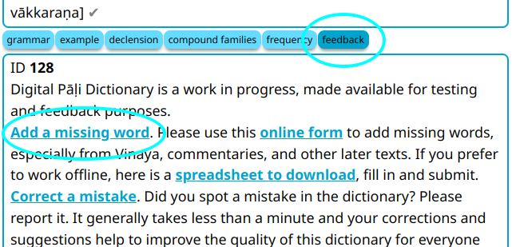

# Добавить Отсутствующее Слово

Если вы обнаружили, что какое-то слово отсутствует в словаре, пожалуйста, добавьте его с помощью [этой формы Google](https://docs.google.com/forms/d/e/1FAIpQLSfResxEUiRCyFITWPkzoQ2HhHEvUS5fyg68Rl28hFH6vhHlaA/viewform){target="_blank"}.

Чтобы добавить слово прямо из словаря, откройте кнопку __feedback__ на любой словарной статье и нажмите [Добавить отсутствующее слово](https://docs.google.com/forms/d/e/1FAIpQLSfResxEUiRCyFITWPkzoQ2HhHEvUS5fyg68Rl28hFH6vhHlaA/viewform){target="_blank"}. Это приведёт вас прямо к форме.

