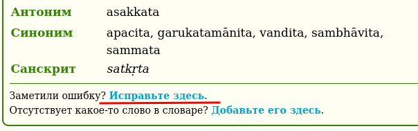
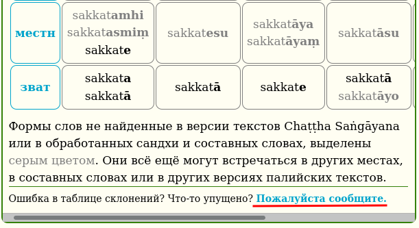
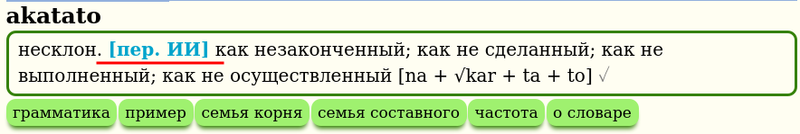

# Форма обратной связи

Заметили ошибку в словаре? Что-то пропущено? Пожалуйста, сообщите об этом, используя [форму обратной связи](https://docs.google.com/forms/d/1iMD9sCSWFfJAFCFYuG9HRIyrr9KFRy0nAOVApM998wM/viewform?usp=pp_url&entry.1433863141=dpd_ru_web). Это обычно занимает менее минуты, и ваши исправления и предложения помогают улучшить качество этого словаря для всех его пользователей.

Внутри словаря есть формы обратной связи, которые автоматически заполняют необходимые поля. Просто щелкните на них напрямую. Одна из них находится в разделе **грамматика**.

И еще одна в разделе **таблицы спряжения**, если вы заметили там что-то неправильное.

Также, в **сводке** для слов, которые были переведены автоматически, имеется прямая ссылка, которая автоматически заполняет необходимые поля.

И во многих других разделах.
