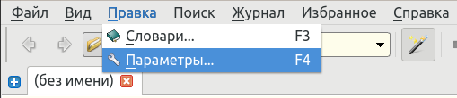

## Настройка горячей клавиши

Независимо от того, используете ли вы [Sutta Central](https://suttacentral.net/), [Digital Pāli Reader](https://www.digitalpalireader.online/_dprhtml/index.html), [Tipitaka Pali Projector](https://www.microsoft.com/en-us/p/tipitaka-pali-projector/9pkwwvrdvnl4#activetab=pivot:overviewtab), [Tipitaka.app](https://tipitaka.app/), PDF-документы или любой другой источник текстов на пали, это позволяет вам щелкнуть по слову и немедленно открыть его в словаре.

Перейдите в Меню > Правка > Параметры (Клавиша F4) > Горячие клавиши.

Выберите предпочтительную горячую клавишу и нажмите ОК. По умолчанию Ctrl-C-C работает отлично, нет необходимости его менять.

Дважды щелкните, чтобы выделить любое слово на пали в любом программном обеспечении или PDF-документе и нажмите горячую клавишу. Откроется небольшое окно GoldenDict. DPD автоматически найдет любое измененное слово в словаре.

Если вы предпочитаете, вы можете каждый раз открывать слово в главном окне.
- Перейдите в меню > Правка > Параметры (Клавиша F4) > **Всплывающее окно**
- Выберите "Отправлять переводимое слово в главное окно"

Если вы пользователь [Digital Pāli Reader](https://www.digitalpalireader.online/), вы можете включить горячую клавишу _одним щелчком_ в настройках.
- Откройте настройки DPR (Клавиша **%**).
- Выберите "**Копировать слова в буфер обмена при щелчке**".

Конечно, вы также можете искать слова на пали по-старому...

- Перейдите в Меню > Вид и выберите Панель поиска (Сочетание клавиш **Ctrl-S**).
- Начните вводить слово в строку поиска и щелкните слово, которое вы ищете.
- Не нужно использовать диакритические знаки при вводе в GoldenDict, он автоматически найдет то, что вы ищете.

Если вы используете Linux, также попробуйте [всплывающее окно](setup_scan_popup.md) - это позволяет открывать слово в словаре одним щелчком.