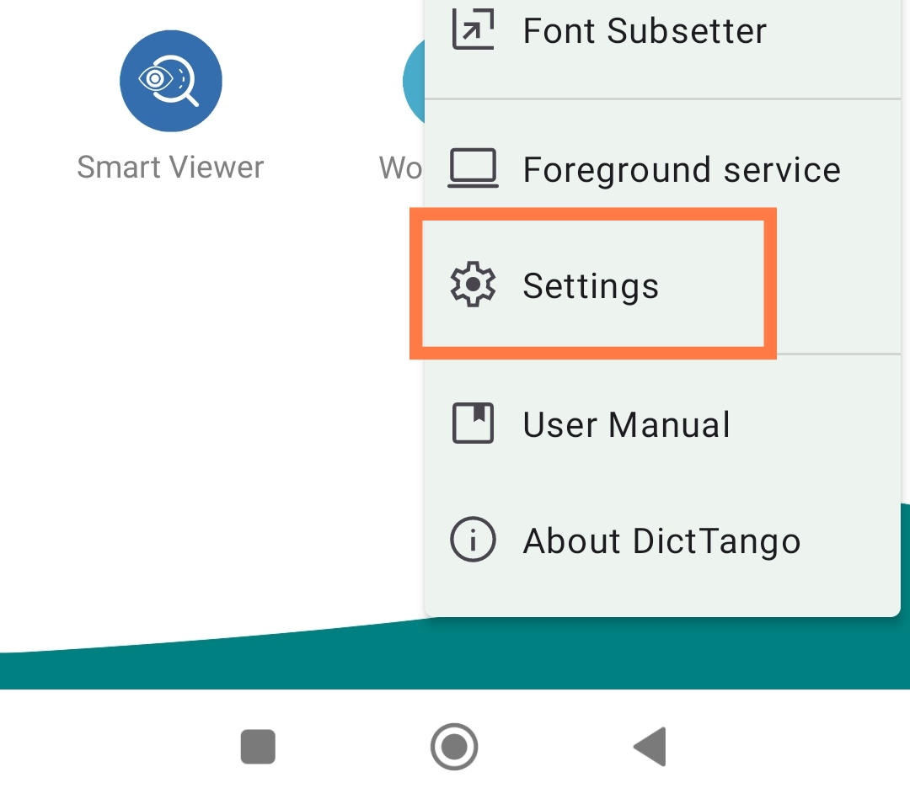
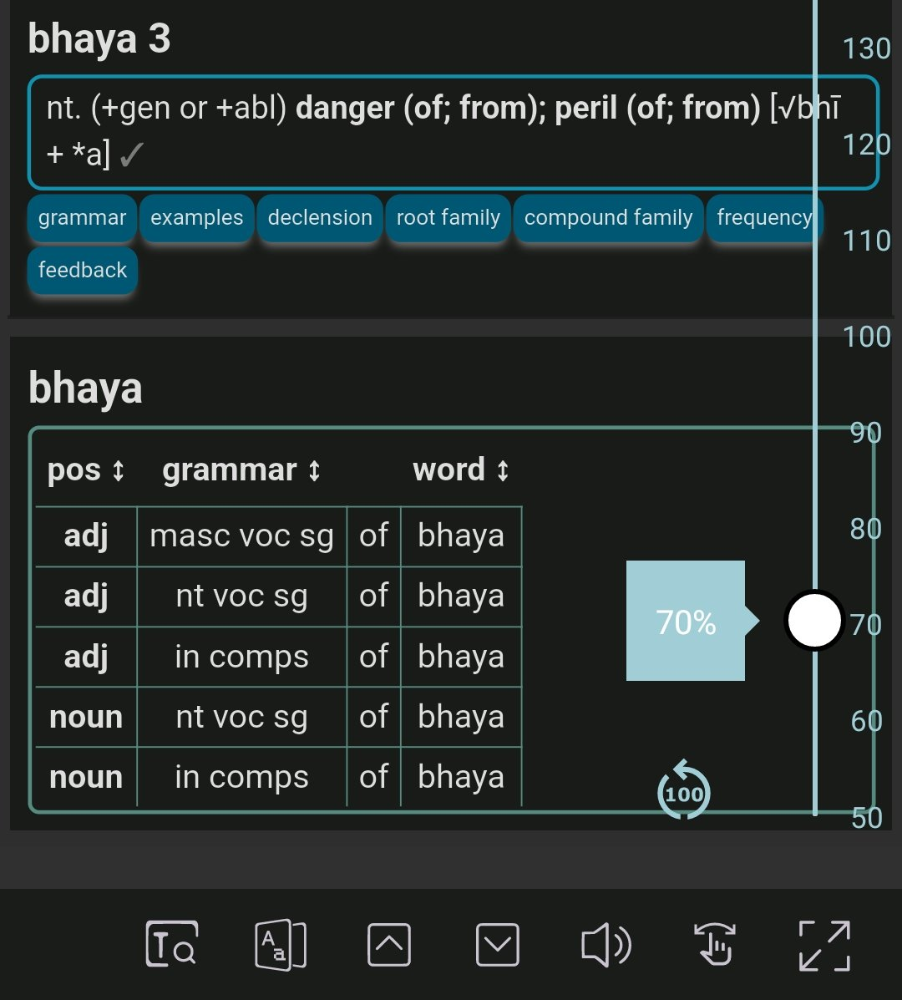

## Установка DictTango на Android

Это поможет вам настроить DPD в приложении DictTango.

### О DictTango

DictTango использует файлы MDict, и предлагает гораздо более удобный пользовательский опыт, чем само приложение MDict.

- Откройте любое слово из PDF или веб-сайта, удерживая его, и используйте всплывающее меню Android.
- После входа в приложение слова можно переходить от слова к слову одним нажатием.
- Он также предлагает полный текстовый поиск, а также множество других продвинутых функций.

### Установка Вкратце

1. Скачайте последнюю версию MDict DPD с [Github](https://github.com/sasanarakkha/dpd-db-sbs/releases/latest/)
2. Скачайте и установите DictTango из [Google Play Store](https://play.google.com/store/apps/details?id=cn.jimex.dict&pcampaignid=web_shareS) или [APKPure](https://m.apkpure.com/dicttango/cn.jimex.dict)

### Подробные инструкции по установке

Ниже приведены подробные последовательные инструкции. Пожалуйста, следуйте им *внимательно*, чтобы получить полную функциональность DPD.

### Скачать и установить DictTango

Скачайте и установите DictTango из [Google Play Store](https://play.google.com/store/apps/details?id=cn.jimex.dict&pcampaignid=web_share) или [APKPure](https://m.apkpure.com/dicttango/cn.jimex.dict)

### Скачать DPD

Скачайте последнюю версию **ru-dpd-mdict.zip** с [Github](https://github.com/sasanarakkha/dpd-db-sbs/releases/latest/)

### Скопируйте файлы DPD в папку DictTango

Используя ваш файловый менеджер на выбор, **распакуйте** ru-dpd-mdict.zip.

Откройте приложение DictTango и нажмите **значок меню** в правом верхнем углу

Нажмите на **Список словарей**

Нажмите на **значок меню** в правом верхнем углу списка словарей

Нажмите **Копировать с SD карты**

**Выберите** (**Select**) 6 файлов RU-DPD в файловом менеджере Android

Выберите **Dictionaries Folder** (**Папка словарей**) как папку назначения

Нажмите **Скопировать сюда**

## Показать все записи

Чтобы увидеть все записи DPD, выполните следующие действия. В противном случае вы увидите только первую запись.

Нажмите **кнопку меню** в правом верхнем углу.

Выберите **Группа словарей**.

Выберите **Default Group** (**Группа по умолчанию**).

Нажмите **Управление словарями**

**Длительное нажатие**, чтобы выбрать любой словарь, затем нажмите **Выбрать все**

Нажмите **Более** в правом нижнем углу.

Нажмите на **Автоматическое развертывание**

Вот и все. Теперь вы увидите все записи из всех словарей.

## Изменение порядка словарей

Находясь там, вы можете изменить порядок отображения словарей.

Нажмите **Кнопку режима сортировки** в правом верхнем углу

**Длительное нажатие и перетаскивание**, или нажмите **стрелки**, чтобы изменить порядок словарей.

## Темный режим

Если вы предпочитаете темный режим, то

Нажмите **кнопку меню** в правом верхнем углу.

Нажмите на **Настройки**

И выберите предпочитаемый темный режим.

Приложение перезапустится в темном режиме.

## Как открыть слово в DictTango

**Длительное нажатие** на слово на языке Пали в любом PDF, doc или на сайте.

Через мгновение появится **меню Android**.

Нажмите на **DictTango**

Все соответствующие записи словаря будут отображены

Оказавшись в DictTango, просто **однократно нажмите** на любое слово, чтобы открыть его.

## Размер шрифта

Чтобы изменить размер шрифта, **откройте** любое слово в словаре.

**Нажмите на значок изменения размера** в правом нижнем углу.

Перетащите **ползунок** вверх и вниз, чтобы изменить размер шрифта.

## Установите больше словарей на Пали и санскрите

Вот хороший выбор [дополнительных словарей на Пали и санскрите](other_dicts.md) для установки на ваше устройство Android.

Наслаждайтесь чтением на Пали с этим отличным приложением для Android!