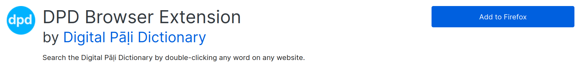
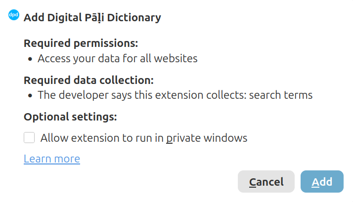

# Установка расширения DPD для браузера

Расширение DPD для браузера добавляет боковую панель словаря в ваш браузер. Дважды щелкните по любому палийскому слову на веб-странице, и определение появится мгновенно — без копирования и переключения вкладок.

Оно работает как в **Google Chrome**, так и в **Mozilla Firefox**.

## Установка

### Chrome

(1) Откройте [страницу DPD в интернет-магазине Chrome](https://chromewebstore.google.com/detail/digital-p%C4%81%E1%B8%B7i-dictionary/hcbcholkdooblegdipdaicdknhmbpbna?pli=1){target="_blank"}.

(2) Нажмите **Установить**.

(3) Нажмите **Установить расширение** во всплывающем окне.

### Firefox

(1) Откройте [страницу DPD на Firefox Add-ons](https://addons.mozilla.org/ru/firefox/addon/digital-p%C4%81%E1%B8%B7i-dictionary/){target="_blank"}.

(2) Нажмите **Добавить в Firefox**.

 

(3) Нажмите **Добавить** во всплывающем окне.

## Закрепление расширения

Закрепление добавляет значок DPD на панель инструментов, чтобы вы могли включать расширение одним щелчком мыши.

### Chrome

(1) Нажмите на **значок пазла** в правом верхнем углу браузера.

(2) Найдите **Digital Pāḷi Dictionary** в списке.

(3) Нажмите на **значок булавки** рядом с ним.

### Firefox

(1) Нажмите на **значок пазла** на панели инструментов Firefox.

(2) Нажмите на **значок шестеренки** рядом с *Digital Pāḷi Dictionary*.

(3) Выберите **Закрепить на панели инструментов**.

## Включение и выключение

Нажмите на **значок DPD** на панели инструментов, чтобы включить или выключить расширение для текущего веб-сайта.

- Когда значок **синий**, расширение **включено**.

- Когда значок **серый**, расширение **выключено**.

Расширение запоминает ваш выбор для каждого веб-сайта отдельно.

## Сайты, на которых расширение включается автоматически

На следующих веб-сайтах расширение включается автоматически без нажатия на значок:

- [SuttaCentral](https://suttacentral.net){target="_blank"}
- [Digital Pāli Reader](https://digitalpalireader.online){target="_blank"}
- [The Buddha's Words](https://thebuddhaswords.net){target="_blank"}
- [tipitaka.org](https://tipitaka.org){target="_blank"}
- [tipitaka.lk](https://tipitaka.lk){target="_blank"}
- [tipitaka.paauksociety.org](https://tipitaka.paauksociety.org){target="_blank"}

Вы по-прежнему можете отключить его на любом из этих сайтов, нажав на значок DPD.

## Поиск слова

Существует три способа поиска слова.

### Двойной щелчок

**Дважды щелкните** по любому палийскому слову на веб-странице.

### Выделение и перетаскивание

**Нажмите и перетащите**, чтобы выбрать слово или короткую фразу, затем отпустите. Это полезно для поиска составных слов или фраз из двух слов.

### Ввод в строке поиска

Введите слово непосредственно в строку поиска в верхней части панели и нажмите **Enter** или кнопку **поиска**.

## Вельтхейс в Юникод

Если у вас не установлена палийская клавиатура, вы можете печатать, используя простые комбинации букв. Они преобразуются в Юникод автоматически.

|Velthuis|>|Unicode|
|----|---|---|
| aa | > | ā |
| ii | > | ī |
| uu | > | ū |
| "n | > | ṅ |
| ~n | > | ñ |
| .t | > | ṭ |
| .d | > | ḍ |
| .n | > | ṇ |
| .m | > | ṃ |
| .l | > | ḷ |
| .h | > | ḥ |

Например, ввод `ni.t.thaa` превращается в `niṭṭhā`.

## Навигация по истории поиска

Каждое слово, которое вы ищете, сохраняется в истории сеанса. Используйте кнопки **Назад** и **Вперед** в заголовке панели для перемещения по предыдущим поискам без повторного ввода.

## Изменение размера панели

Потяните за **левый край** панели, чтобы сделать ее шире или уже.

## Тема

Расширение автоматически подстраивается под цветовую схему веб-сайта, на котором вы находитесь. Чтобы установить ее вручную, нажмите на **значок палитры** в заголовке панели.

Тема сохраняется для каждого веб-сайта.

## Настройки

Нажмите на **значок шестеренки** в заголовке панели, чтобы открыть настройки.

### Размер шрифта

Нажмите **–** или **+**, чтобы уменьшить или увеличить размер текста в панели.

### Ниггахита ṃ / ṁ

Выберите предпочтительное представление 41-й буквы палийского алфавита — `ṃ` (точка внизу) или `ṁ` (точка вверху).

### Грамматика Скрыта / Раскрыта

Когда **включено**, раздел грамматики открывается по умолчанию для каждого нового найденного слова.

### Примеры Скрыты / Раскрыты

Когда **включено**, раздел примеров предложений открывается по умолчанию для каждого нового найденного слова.

### По одному разделу за раз

Когда **включено**, открытие одного раздела автоматически закрывает любой другой открытый раздел. Когда **выключено**, несколько разделов могут оставаться открытыми одновременно.

### Сводка Скрыть / Показать

Сводка — это краткий обзор результатов, отображаемый в верхней части панели. Переключите, чтобы скрыть или показать ее.

### Сандхи ' Скрыть / Показать

DPD отмечает места соединения сандхи апострофом **'**, например `vat'amhi`. Переключите, чтобы показать или скрыть маркеры апострофа.

### Аудио Мужской / Женский

Выберите мужской или женский голос для произношения аудио.

### Использовать GoldenDict

Когда **включено**, двойной щелчок по слову открывает его непосредственно в [GoldenDict](https://github.com/xiaoyifang/goldendict-ng){target="_blank"} вместо боковой панели.

Это очень удобная функция. Обычно для поиска слова в GoldenDict нужно скопировать слово и нажать Ctrl+C+C — с этой настройкой достаточно одного двойного щелчка на любой веб-странице.

Расширение также автоматически переключается на GoldenDict, если вы находитесь в автономном режиме (оффлайн).

### Свернуть панель

Сворачивает панель в тонкую полоску у правого края экрана. Нажмите на **стрелку** на полоске, чтобы снова развернуть ее.

## Как пользоваться

Нажмите на **кнопку ⓘ info** в заголовке панели в любое время, чтобы увидеть краткое руководство по использованию расширения.

## Обратная связь

Возникли проблемы? Хотите предложить функцию? Нажмите на ссылку внизу страницы, чтобы открыть форму обратной связи.

