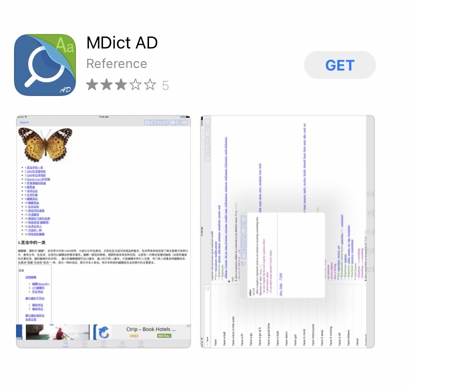
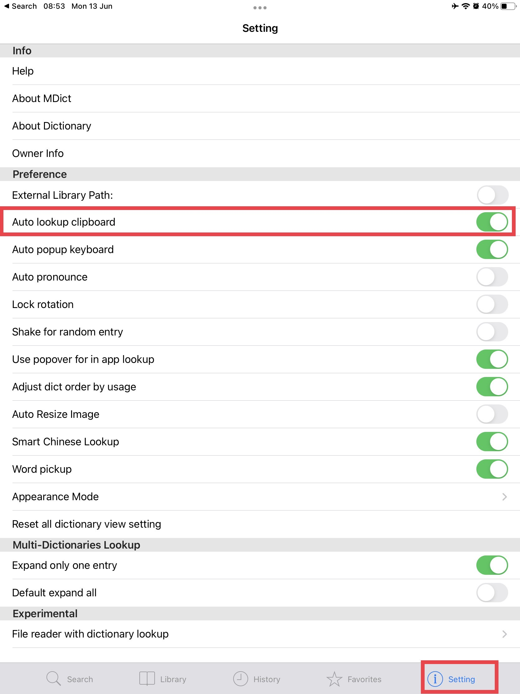

# Установка MDict на iOS

## Вкратце

1. Загрузите последнюю версию DPD для MDict (ru-dpd-mdict.mdx) [здесь](https://github.com/sasanarakkha/dpd-db-sbs/releases/latest/).
2. Установите MDict из [App Store](https://apps.apple.com/us/app/mdict-ad/id894362875).
3. Переместите файл ru-dpd-mdict.mdx в папку MDict на вашем устройстве iOS.

Ниже приведены подробные инструкции *anupubba*.

## Загрузка DPD

Прежде всего, загрузите последнюю версию Цифрового Словаря Пали для MDict с [Github](https://github.com/sasanarakkha/dpd-db-sbs/releases/latest/).

## Загрузка MDict

Найдите приложение **MDict** в App Store на вашем устройстве и нажмите **Скачать**, чтобы установить.

## Установка файла DPD

Есть 2 способа установки.

Поместите файл ru-dpd-mdict.mdx в вашу **Библиотеку**, он установится автоматически.

Или откройте приложение **Files**.

И переместите файл ru-dpd-mdict.mdx в папку **MDict** в разделе **На моем iPhone**.

## Откройте MDict

Теперь вы можете использовать DPD, выполнив поиск.

## Настройки автоматического поиска

В **Настройках** включите **Автоматический поиск по буферу обмена**. Теперь вы можете **скопировать** любое слово в тексте на Пали, чтобы автоматически открыть его в MDict.

## Настройки однократного нажатия в DPR

Кроме того, если вы используете Digital Pāli Reader, откройте **Настройки** и включите **Копировать слова в буфер обмена при нажатии**.

Теперь просто **нажмите** на любое слово, чтобы открыть его в MDict.

Ваше устройство iOS готово к использованию!