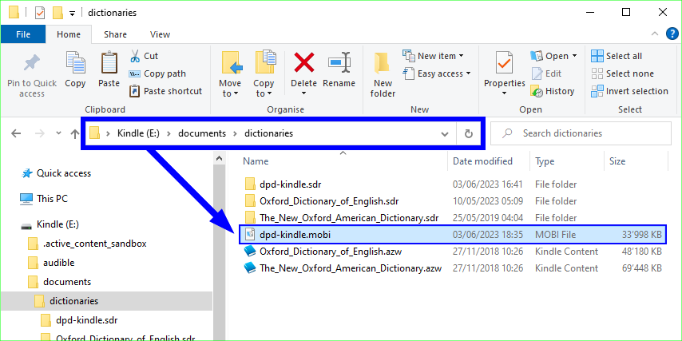

# DPD на Kindle

Теперь доступна легкая версия DPD для Amazon Kindle.

## Установка

1. Загрузите последнюю версию **ru-dpd-kindle.mobi** с [этой страницы на GitHub](https://github.com/sasanarakkha/dpd-db-sbs/releases/latest/).

2. Скопируйте этот файл в следующую папку на вашем Kindle: `/documents/dictionaries`

3. Перезагрузите Kindle.

4. Нажмите и удерживайте любое Пали слово, затем выберите словарь.

5. Выберите **Цифровой Словарь Пали** из списка доступных словарей.

6. Вот и всё, вы настроились! Наслаждайтесь возможностью просмотра измененных форм любого слова на Пали.

