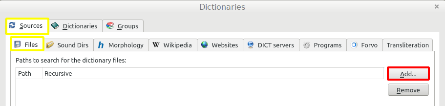
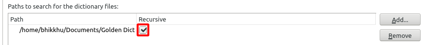

# Установка GoldenDict на Linux

## Кратко

1. Скачайте последнюю версию DPD [здесь](https://github.com/digitalpalidictionary/rus-release/releases).
2. Установите версию 1.5 GoldenDict.
3. В настройках направьте GoldenDict в папку DPD.

Ниже подробные инструкции *anupubba*.

## Скачать DPD

Прежде всего, скачайте последнюю версию Цифрового Словаря Пали с [Github](https://github.com/digitalpalidictionary/rus-release/releases).

## Создайте папку GoldenDict

Рекомендуется создать легкодоступную папку GoldenDict, например, `/Documents/GoldenDict`.


Или в терминале:
```
mkdir /home/ваше_имя_пользователя/Documents/GoldenDict
```
(Очевидно, замените ваше_имя_пользователя на ваше реальное имя пользователя)

## Разархивируйте

Щелкните правой кнопкой мыши по zip-файлу DPD в папке Загрузки и откройте его с помощью Архивного менеджера.


Нажмите Извлечь и выберите папку `/Documents/GoldenDict`.


Или в терминале:
```
cd home/ваше_имя_пользователя/Загрузки
unzip /home/ваше_имя_пользователя/Загрузки/ru-dpd.zip -d /home/ваше_имя_пользователя/Documents/GoldenDict
```

## Установите GoldenDict

GoldenDict можно установить напрямую с помощью apt-get:
```
sudo apt-get update
sudo apt-get install goldendict
```

Или выберите дистрибутив по вашему выбору с [сайта pkgs.org](https://pkgs.org/download/goldendict).

Или непосредственно из Менеджера программ:


Убедитесь, что устанавливается версия 1.5, а не версия 1.0!

## Добавление словарей в GoldenDict

Запустите приложение GoldenDict.

Перейдите в Меню > Редактировать > Словари (Клавиша **F3**).


Перейдите в Источники > Файлы.

Нажмите Добавить и выберите папку `/Documents/GoldenDict`.



Установите флажок рекурсивного поиска √ (это гарантирует поиск в подпапках).



Нажмите OK и подождите несколько моментов, пока словари индексируются.

Вы готовы!

Далее узнайте, как [настроить горячую клавишу](setup_hotkey.md) или [настроить всплывающее окно](setup_scan_popup.md), чтобы вы могли щелкнуть по любому слову Пали в любом тексте и сразу открыть его в словаре.

