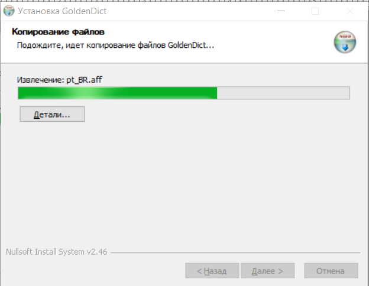
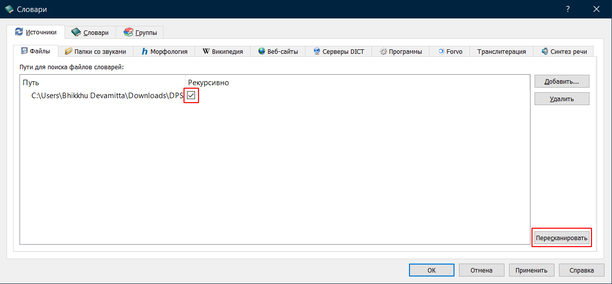
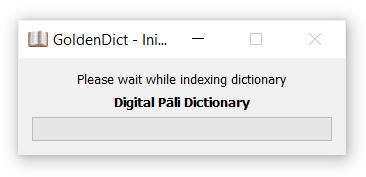

# Установка GoldenDict на Windows

## Вкратце

1. Скачайте последнюю версию DPD [здесь](https://github.com/sasanarakkha/dpd-db-sbs/releases/latest/).
2. Установите свежую версию [GoldenDict](https://github.com/xiaoyifang/goldendict-ng/releases/download/v24.05.05-LiXia.ecd1138c/6.7.0-GoldenDict-ng-Installer.exe).
3. В настройках укажите GoldenDict папку с DPD.

Вот [видео](https://www.youtube.com/watch?v=KZ4CecdVL0k), чтобы помочь вам с установкой на Windows от [канала Learn Pali на Youtube](https://www.youtube.com/channel/UC73nNRzMzvweRb52ArFG3Gg).

Ниже приведены подробные *anupubba* инструкции в текстовом формате.

## Установка GoldenDict

Скачайте последнюю версию GoldenDict NG с [Github](https://github.com/xiaoyifang/goldendict-ng/releases/download/v24.05.05-LiXia.ecd1138c/6.7.0-GoldenDict-ng-Installer.exe).

Перейдите в вашу папку `Загрузки` и дважды щелкните `6.7.0-GoldenDict-ng-Installer.exe`.

<!-- [gd exe](../pics/win-install/gd%20exe.png) -->

Выберите ваш язык. Нажмите **OK**.

Нажмите **Далее >**.

Нажмите **Принимаю**.

Выберите место установки и нажмите **Далее >**.

Нажмите Установить.

Установка…

Нажмите Готово.

## Скачать DPD

Скачайте последнюю версию Цифрового Словаря Пали с [Github](https://github.com/sasanarakkha/dpd-db-sbs/releases/latest/).

## Создание папки GoldenDict

Рекомендуется создать легко доступную папку GoldenDict, например `\Documents\GoldenDict`.

## Распаковка

Щелкните правой кнопкой мыши на файле .zip в папке Загрузки и выберите "Извлечь все".

Выберите папку `\Documents\GoldenDict` и нажмите Извлечь.

Теперь в `\Documents\GoldenDict` будет папка `DPD`.

## Настройка GoldenDict

Запустите GoldenDict из меню Пуск.

Откройте Меню > Правка > Словари (клавиша F3).

Нажмите Добавить.

Перейдите в `\Documents\GoldenDict` и нажмите Выбрать папку.

Установите флажок **Рекурсивно** (это гарантирует добавление всех подпапок). И нажимите **Пересканировать**

Подождите, пока словарь будет проиндексирован.

Всё готово!

---

Можно почитать, как [настроить горячую клавишу](setup_hotkey.md), чтобы вы могли щелкнуть на любое слово на Пали в любом тексте и мгновенно открыть его в словаре.