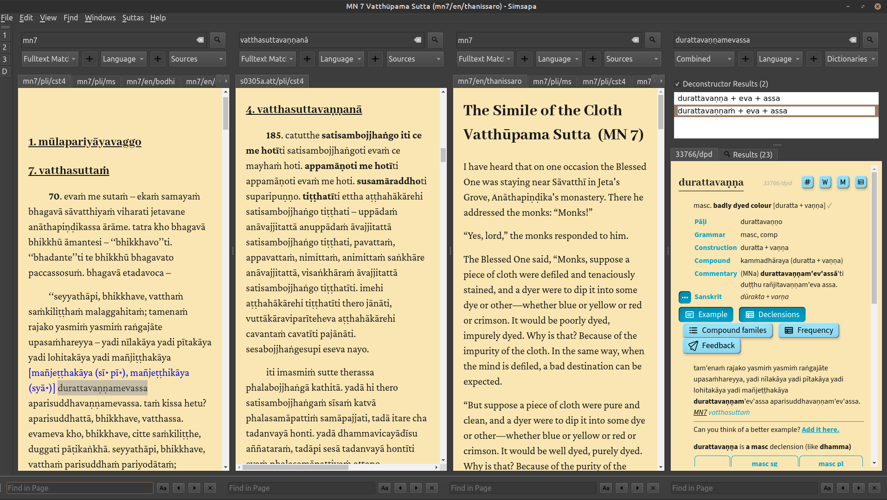

## Simsapa Dhamma Reader

DPD интегрирован в [Simsapa Dhamma Reader](https://simsapa.github.io/), очень мощное новое приложение для погружения в изучение Пали.

Симсапа стремится быть всё-в-одном приложением, которое содержит:

- CST4 Chaṭṭha Saṅgāyana Типитаку
- Тексты и переводы SuttaCentral
- Полный набор Пали словарей
- Переводы dhammatalks.org от Аджана Тханиссаро
- Множество электронных книг о Дхамме
- Санскритские тексты Gretil
- Санскритские словари
- И многое другое

*(щелкните правой кнопкой мыши и откройте в новой вкладке, чтобы увидеть изображения в полном размере)*

Каждый раз при выпуске новой версии DPD, Simsapa автоматически обновляется с последней информацией из базы данных DPD.

Для получения дополнительной информации и инструкций по установке посетите [веб-сайт Simsapa](https://simsapa.github.io/).