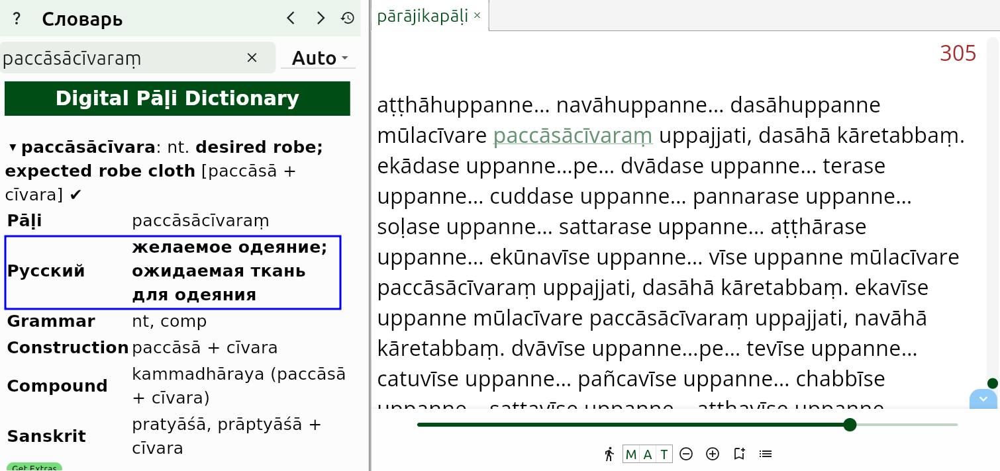

# Tipitaka Pali Reader

**Tipitaka Pali Reader** - отличное новое приложение для чтения палийских текстов, разрабатываемое [Дост. Субхути](https://americanmonk.org/) и Дост. Паньяджаджа в Мьянме. Дополнительную информацию о TPR можно найти на [этом веб-сайте](https://americanmonk.org/tipitaka-pali-reader/).

TPR доступен для всех операционных систем и устройств. Загрузите последнюю версию для Windows, Mac, Linux, iOS и Android с [этой страницы на GitHub](https://github.com/bksubhuti/tipitaka-pali-reader/releases).

Существует поддержка русского языка.

Легковесная версия английского DPD доступна внутри приложения Tipitaka Pali Reader. Она содержит только грамматическую информацию для каждого слова, без прочих кнопок.

Чтобы открыть слово в словаре, просто щелкните по нему, и откроется словарь. TPR использует ту же систему для распознавания измененных форм и сандхи, что и DPD, поэтому будут отображены только правильные возможности.

Чтобы увидеть подробную грамматическую информацию, щелкните по маленькой стрелке на записи в словаре, и появится больше информации.

Грамматический словарь DPD также включен для отображения возможных склонений и спряжений слова.

## Получите последнюю версию DPD

Tipitaka Pali Reader позволяет вам загрузить различные дополнения. Сюда входят словари на других языках, построчные переводы на английский язык с SuttaCentral и книги для чтения.

Чтобы получить самую последнюю версию DPD:

1. Откройте **Меню** и нажмите **Настройки**.

2. Нажмите **Расширения**.

3. Выберите **DPD**. Это шестой элемент в списке.

4. Файл загрузится, а затем установится сам.

5. **ПОЖАЛУЙСТА, ОБРАТИТЕ ВНИМАНИЕ!** Подождите, пока вы снова не увидите меню Дополнений, это означает, что DPD установлен правильно.

Пока вы здесь, можете скачать что-то еще, что может быть вам полезно!

## Совмещенная версия DPD

Здесь вы можете скачать совмещенную версию, 

Я лично использую TPR для чтения палийских текстов, и удобно иметь русскую колонку совмещенную с полным DPD английским функционало. Чтобы получить эту совмещенную версию словаря, прокрутите вниз до конца списка Дополнений, нажмите на **DPD with Russian** и установите точно так же, как описано выше.

