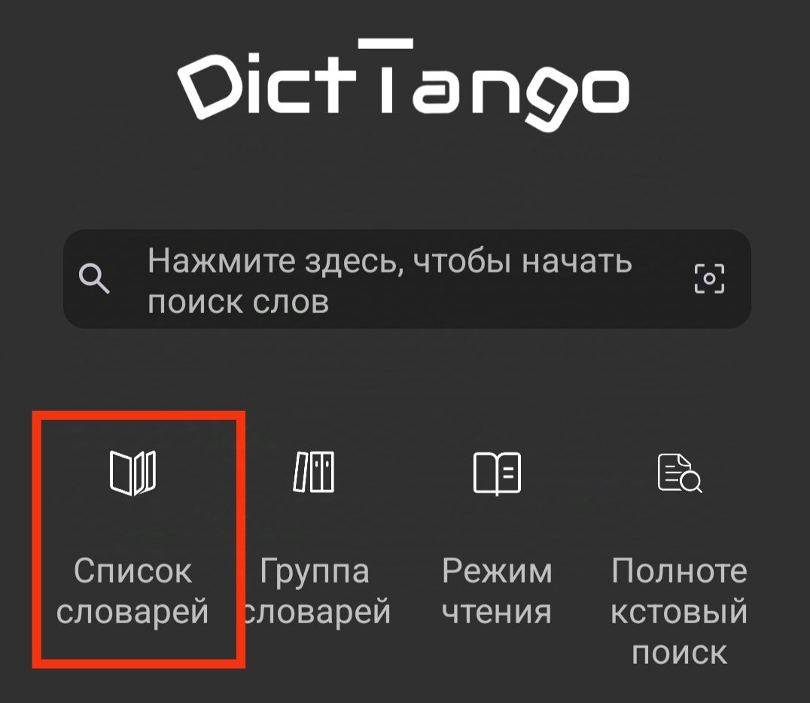
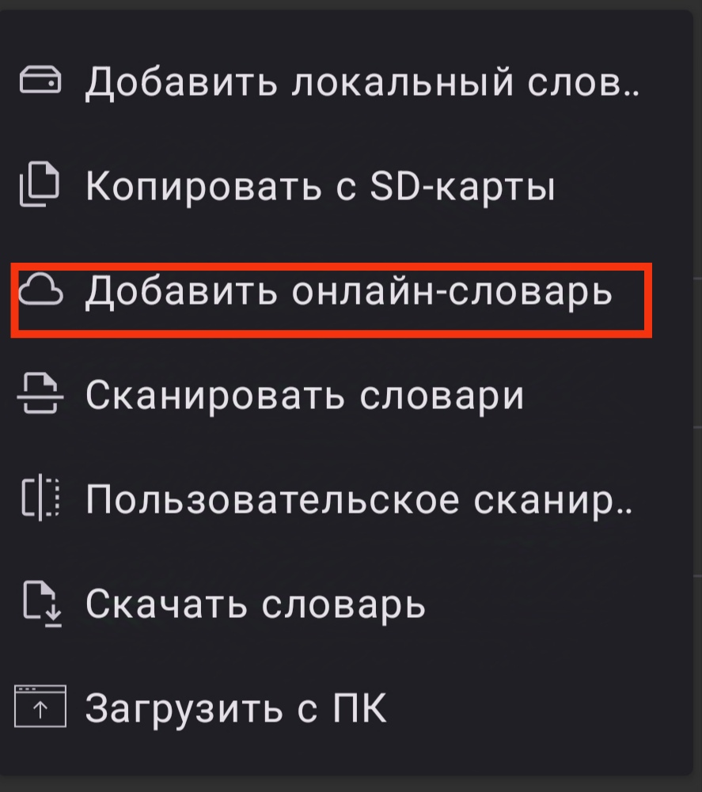
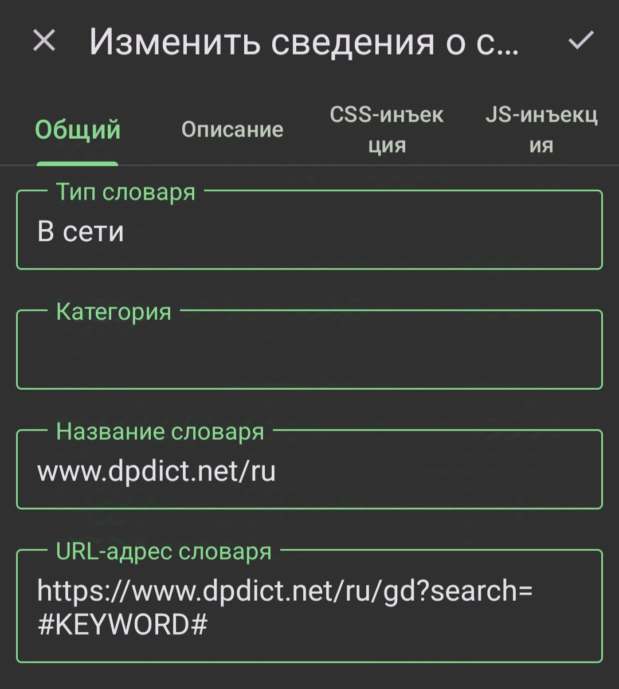

## Настройка API в DictTango

Эта статья о том как настроить DPD как сайт для онлайн-поиска в DictTango.

Преимуществом является то, что настройка достаточно быстрая и простая, а также всегда актуальна с последней версией базы данных DPD. Недостатком является то, что поиск может быть на секунду медленнее.

С главной страницы выберите **Список словарей**.

Откройте кнопку **Меню** на странице списка словарей.

Выберите **Добавить онлайн-словарь**.

Добавьте следующую информацию в раздел **Изменить сведения о словаре**:

Название словаря: www.ru.dpdict.net\
URL-адрес словаря: https://ru.dpdict.net/gd?search=#KEYWORD#

Вот и всё, настройка завершена!

