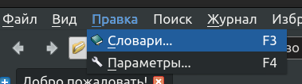

## Настройка API в GoldenDict

Эта статья о том как настроить DPD как сайт для онлайн-поиска в GoldenDict. 

Преимуществом является то, что настройка достаточно быстрая и простая, а также всегда актуальна с последней версией базы данных DPD. Недостатком является то, что поиск может быть на секунду медленнее.

⚠️ Это не будет работать одновременно с оффлайн-версией DPD. Пожалуйста, отключите её перед продолжением.

## Инструкция

Перейдите в Меню > Редактировать > Словари (Клавиша **F3**).

(1) В **Источниках** перейдите на вкладку **Веб-сайты**

(2) Нажмите **Добавить**

(3) Добавьте следующую информацию:

Enable: checked\
As Link: unchecked\
Name: www.ru.dpdict.net\
Address: https://ru.dpdict.net/gd?search=%GDWORD%

(1) Перейдите на вкладку **Словари**

(2) Перетащите www.ru.dpdict.net в нужное вам место в списке

Вот и всё, настройка завершена!

ДАЛЕЕ: [Настройка API в DictTango](dpdict_api_dt.md)