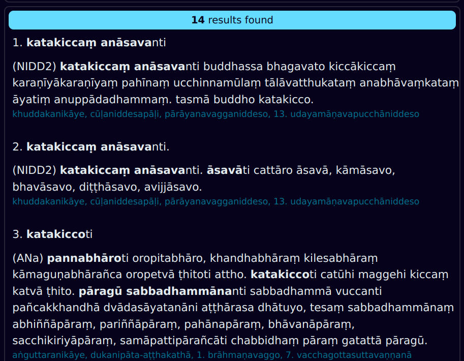

## Поиск Выделенных определений CST

В Chaṭṭha Saṅgāyana Tipiṭaka более **300 000** слов выделены **жирным шрифтом** — это определения других слов на Пали.

> **sikkhā**ti tisso sikkhā – adhisīlasikkhā, adhicittasikkhā, adhipaññāsikkhā. tatra yāyaṃ adhisīlasikkhā, ayaṃ imasmiṃ atthe adhippetā sikkhāti.

Эти выделенные определения встречаются в *vinaya-piṭaka*, *khuddaka-nikāya*, *aṭṭhakathā*, *ṭīkā* и других разделах текстов CST.

На протяжении тысячелетий именно такие определения внутри самих текстов на Пали служили словарём для буддийских монахов.  

Теперь DPD предоставляет [веб-поисковик](https://dict.dhamma.gift/ru){target="_blank"} для удобного доступа к этому удивительному ресурсу.

## Базовый поиск

Нажмите на вкладку **Выделенные определения CST** в левом верхнем углу веб-страницы, чтобы открыть её.

Есть два поисковых поля.

В первое поле введите определение, которое вы хотите найти.

> Совет: опускайте последнюю букву слова, так как она часто сливается с *iti* при сандхи.

**Нажмите Ввод** или **кликните "поиск"**, чтобы получить результаты.

Результаты отобразятся ниже.

В результатах вы увидите определяемое слово (выделенное), само определение и окружающий контекст. Источник текста и раздел будут выделены синим.

## Режимы поиска

Существует три различных режима поиска.

### 1. Начинается с
Показывает результаты, **начинающиеся** с введённого слова. Полезно, если вы точно знаете, что ищете.

### 2. Обычный/rx  
Это режим по умолчанию. Показывает результаты, **содержащие** поисковое слово. Также можно использовать [**регулярные выражения**](https://habr.com/ru/articles/545150/){target="_blank"} для продвинутого поиска.

### 3. Нечеткий  
При включении **приблизительного поиска** игнорируются все диакритики, аспирация, удвоенные согласные и различия между носовыми звуками. Это полезно, если вы не знаете точного написания, но также даст гораздо больше результатов.

> Например, нечеткий-поиск по *karaṃ* также найдёт *kārañ, kharaṅ, khāraṃ* и т.д.

## Поиск внутри результатов

Иногда результаты оказываются слишком обширными.

Тогда можно воспользоваться вторым поисковым полем для уточнения результатов.

Это значительно сократит число найденных фрагментов.

Обратите внимание, что слово из второго поиска подсвечено синим в тексте.

Вот и всё. Наслаждайтесь этим мощным инструментом поиска!

## Проблемы

Если вы обнаружили ошибку или у вас есть предложения по улучшению, добавьте их в [раздел Issues на GitHub](https://github.com/sasanarakkha/dpd-db-sbs/issues){target="_blank"}.

Исходный код можно найти [здесь](https://github.com/sasanarakkha/dpd-db-sbs/blob/6eaaa4c58059e5e03ecdf522635335b89a5e4b1d/exporter/webapp/main.py#L223){target="_blank"}.

## Благодарности

Благодарим **Vipassana Research Institute** за то, что они сделали эти цифровые тексты в формате XML свободно доступными для некоммерческого использования. Их можно найти на [GitHub](https://github.com/VipassanaTech/tipitaka-xml){target="_blank"}.
