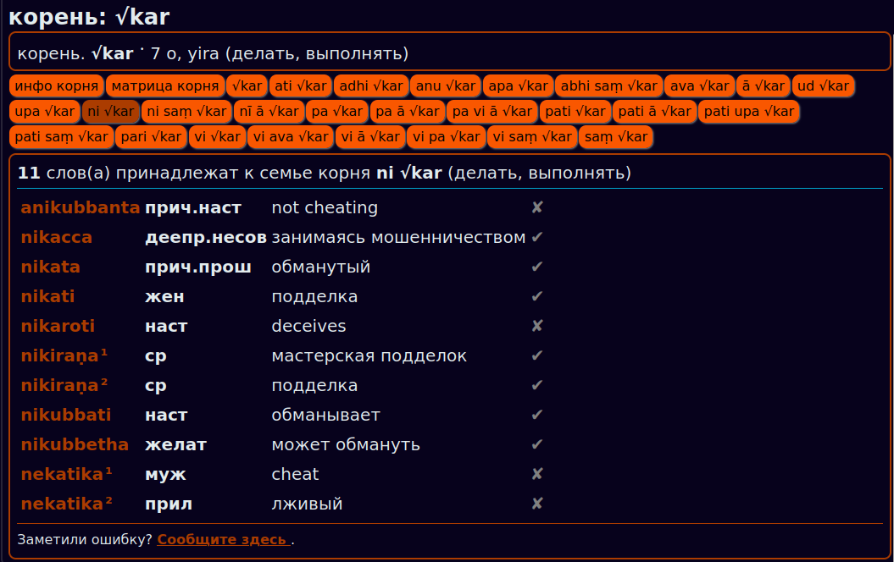

## Отображение словаря

[www.dpdict.net/ru](https://www.dpdict.net/ru) отображает все словари DPD, включая:

### 1. Основной DPD

### 2. Корни

### 3. Деконструктор

### 4. Варианты чтений и орфографические ошибки

### 5. Грамматический словарь

### 5. Помощь и сокращения

### 6. Словарь с английского на пали

### 7. Словарь с русского на пали

ДАЛЕЕ: [Настройки](dpdict_settings.md)