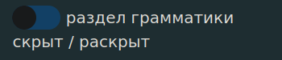
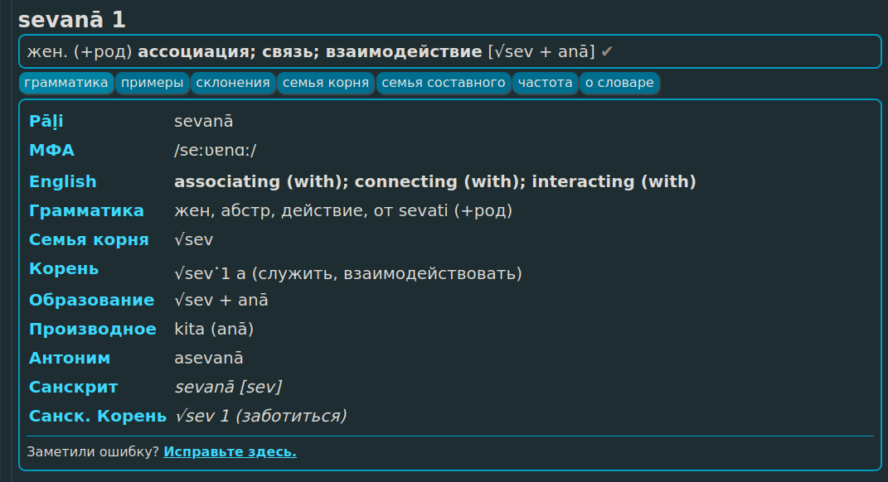
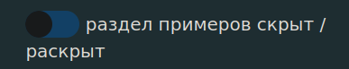
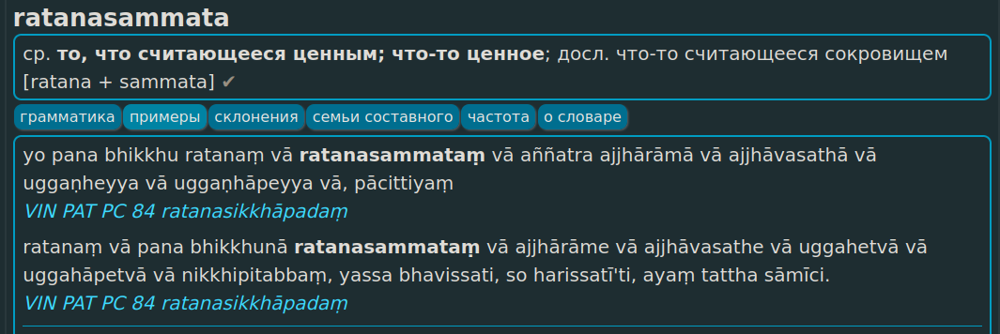
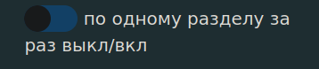
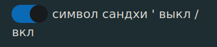

## Настройки

[www.dpdict.net/ru](https://www.dpdict.net/ru) предлагает множество настроек для персонализации.

## Размер шрифта

Нажмите на кнопки, чтобы **увеличить** или **уменьшить** размер шрифта для удобного просмотра, будь то молодые или старые глаза. 

## Дневной или ночьной режим

Переключайтесь между обычным светлым режимом или тёмным режимом для уменьшения нагрузки на глаза.

## Шрифт без засечек или с засечками

Выберите шрифт с засечками (serif) или без засечек (sans).

## Ниггахита ṃ или ṁ

Выберите предпочитаемое представление 41-й буквы алфавита пали.

## Меню грамматики развернуто или скрыто

Если вы хотите всегда видеть **меню грамматики**, включите эту настройку.

Все новые слова будут отображаться с развернутым меню грамматики по умолчанию.

## Меню примеров развернуто или скрыто

Если вы хотите всегда видеть **меню примеров**, включите эту настройку.

Все новые слова будут отображаться с развернутым меню примеров по умолчанию.

## Только одно меню за раз

По умолчанию при открытии нового меню, оно будет отображаться. Если включена эта настройка, одновременно будет показана только одно меню.

## Сводка

Скрыть или отобразить краткое изложение результатов в верхней части страницы. Эта настройка включена по умолчанию. 

## Показать сандхи символом '

По умолчанию все сандхи в DPD отмечены одинарной кавычкой **'**. Эта настройка позволяет скрыть или отобразить маркер сандхи.

СКРЫТО: akaṅkhī vatamhi avicikicchī niṭṭhaṅgato saddhammeti.\
ПОКАЗАНО: akaṅkhī vat'amhi avicikicchī niṭṭhaṅ'gato saddhamme'ti.

ДАЛЕЕ: [Настройка API в GoldenDict](dpdict_api_gd.md)

