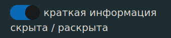

## Сводка

Краткое изложение результатов поиска отображается вверху.

Нажмите на **подсвеченное слово** или **стрелку**, чтобы перейти непосредственно к записи.

Это краткое изложение результатов поиска можно отключить в настройках.

ДАЛЕЕ: [Настройки](dpdict_settings.md)